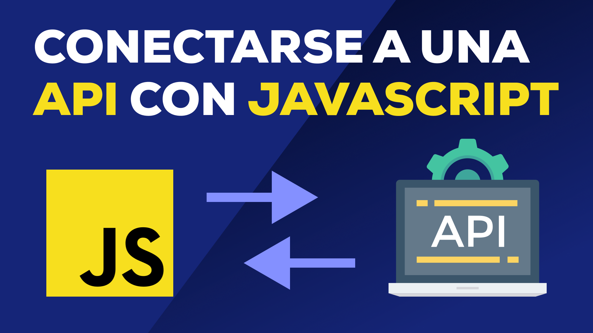

#

# UNIVERSIDAD TECNOLÓGICA DE LA SIERRA HIDALGUENSE

### Docente: Senen Aldahir Mayorga Garcia

### Alumna: Liliana Leticia Pérez del Ángel

### Asignatura: Aplicaciones Web Orientadas a Servicios

### Nombre del proyecto: Cómo conectarse a una API con JavaScript

### Tecnologías utilizadas en el proyecto: JavaScript, Fetch API, HTML, CSS.

### Carrera: TECNOLOGÍAS DE LA INFORMACIÓN, ÁREA DESARROLLO DE SOFTWARE MULTIPLATAFORMA

### 4TIDSM-G1

### Cuatrimestre: Septiembre-Diciembre 2024

#

